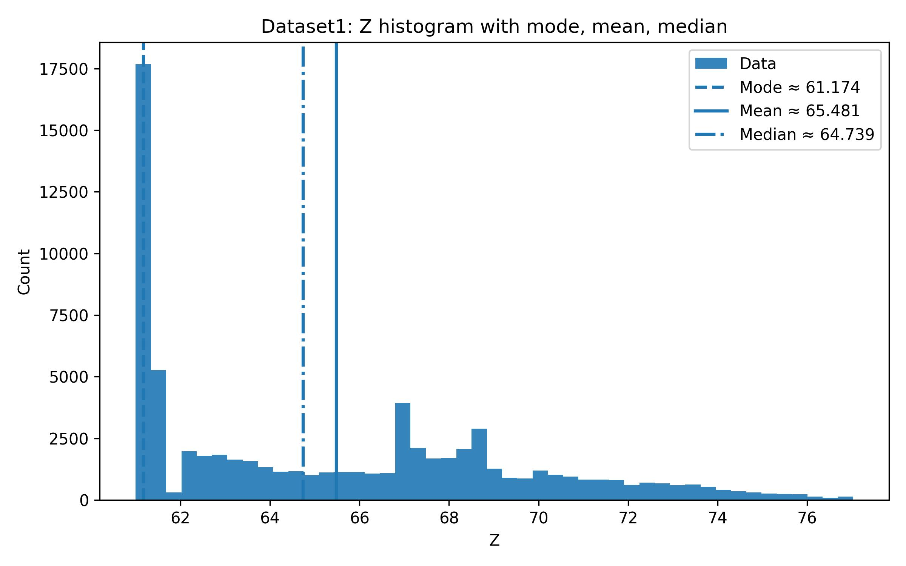
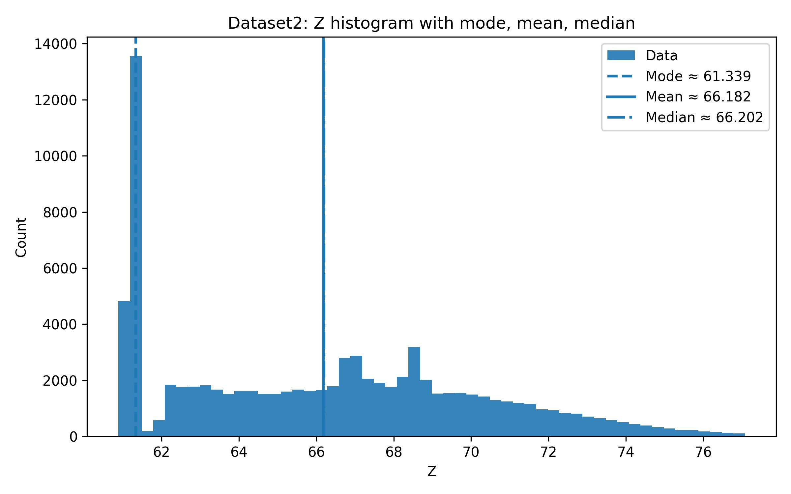
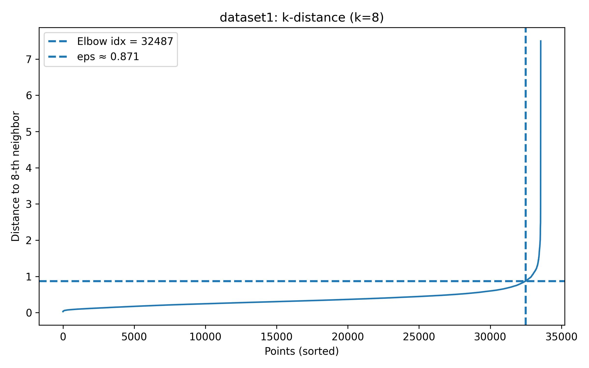
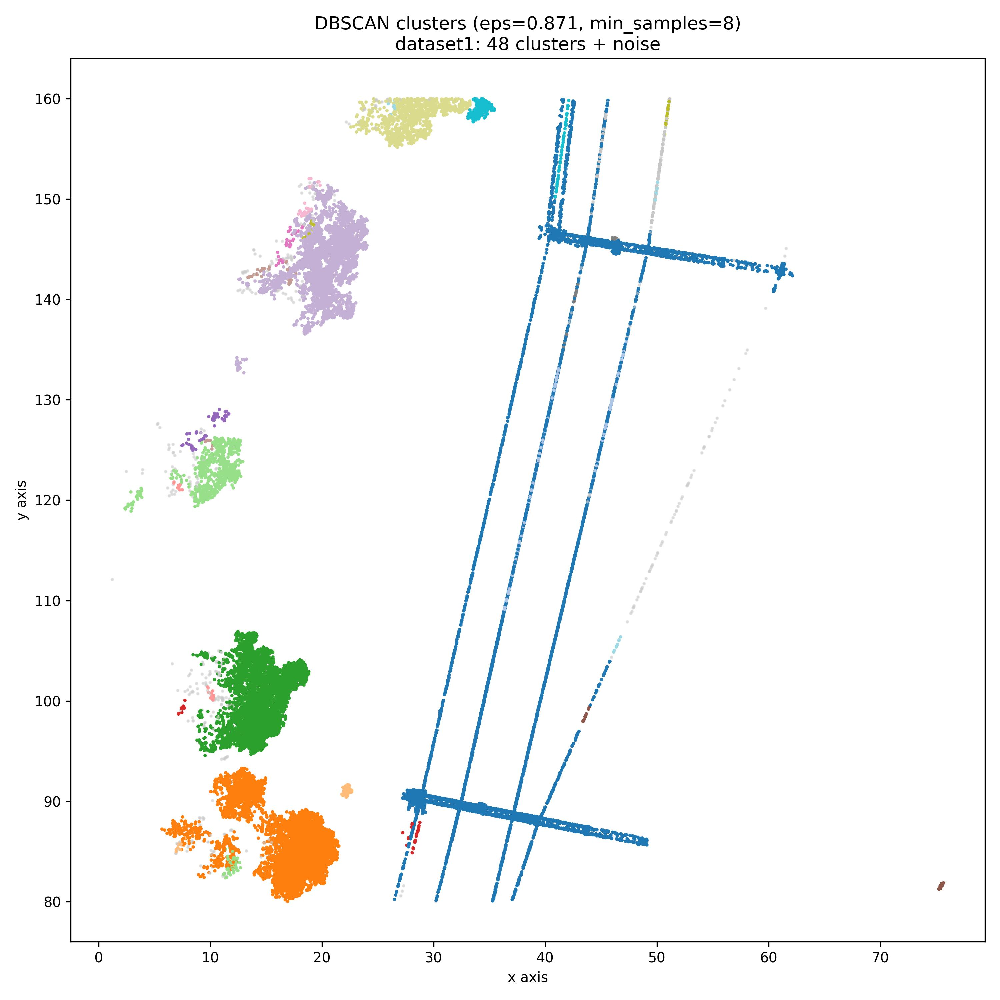
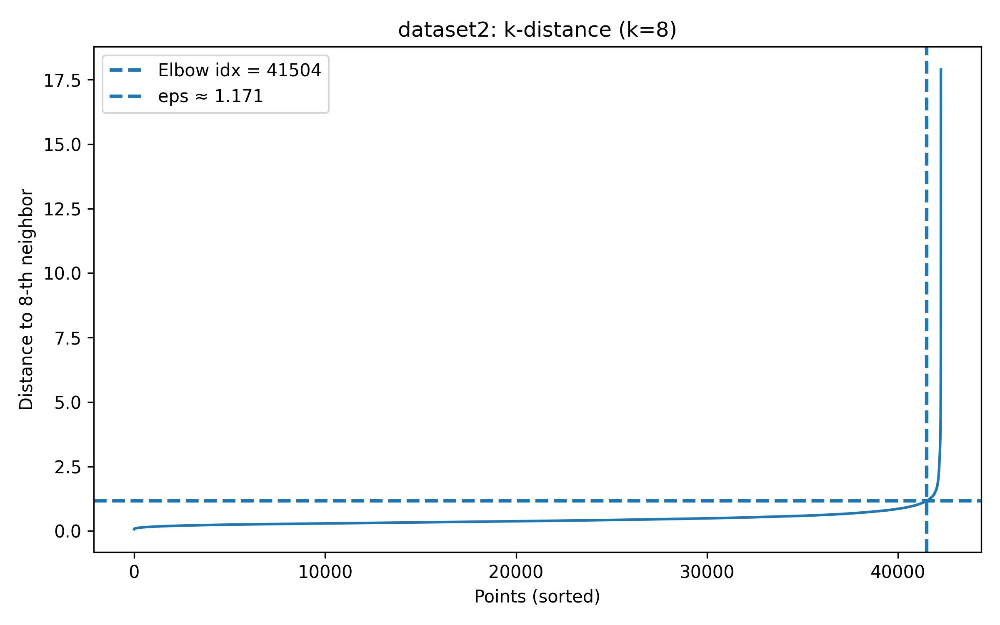
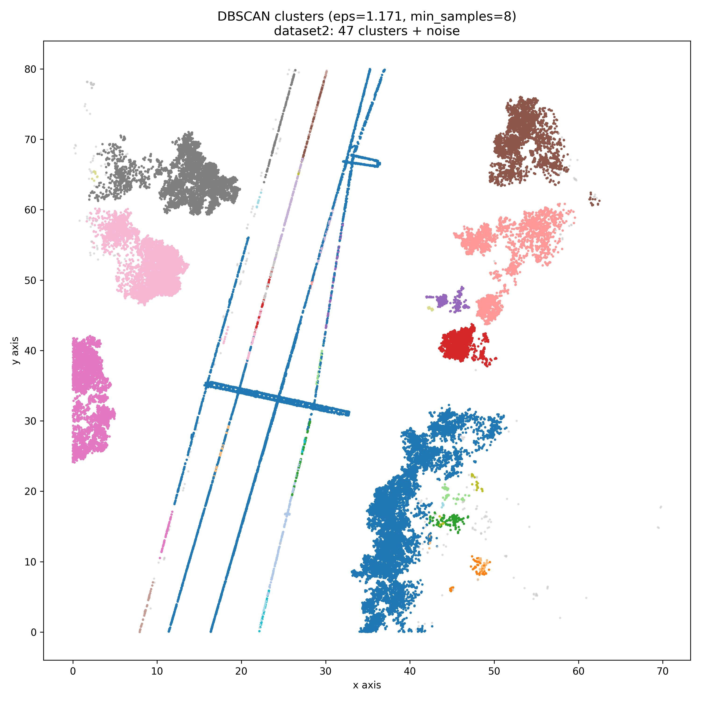

# Railway LiDAR Spatial Data Analytics

The histograms below summarize the elevation (Z-axis) distributions for two point-cloud datasets captured along a ~70 m railway segment. These visuals are used to infer a data-driven ground-level threshold for filtering and for improving the robustness of subsequent clustering.

## Histograms

### Dataset 1 — Z-axis Histogram
The distribution exhibits a dominant ground-return mode with a right-skewed tail corresponding to above-ground structures (e.g., rails, sleepers, and nearby objects). This supports selecting a threshold just above the ground mode for reliable ground filtering.

### Dataset 2 — Z-axis Histogram
A similar pattern is observed for Dataset 2, with a pronounced ground mode and a long upper tail. Consistency across datasets enables adopting a comparable ground-level cutoff for cross-dataset analysis.

## Optimizing DBSCAN ε via *k*-Distance (Elbow) Analysis

### Dataset 1 — Elbow Analysis
The sorted 8-NN distance curve exhibits a clear inflection, yielding an estimated neighborhood radius of **ε ≈ 0.871** for DBSCAN.

Applying **ε = 0.871** (with `min_samples = 8`) produces coherent spatial clusters while isolating noise, capturing the rail lines and surrounding structures.

### Dataset 2 — Elbow Analysis
The 8-NN distance profile indicates an elbow at higher distances, recommending **ε ≈ 1.171** for DBSCAN on Dataset 2.

Using **ε = 1.171** (with `min_samples = 8`) yields well-separated clusters and filters outliers, consistent with the scene geometry.

